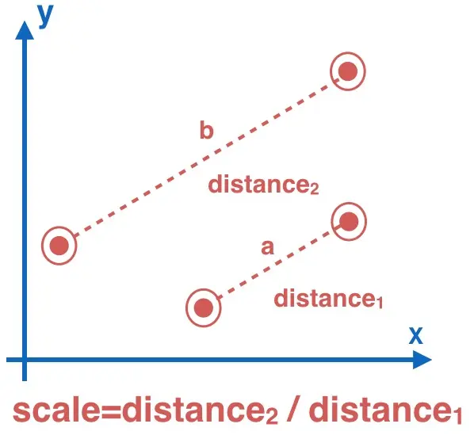
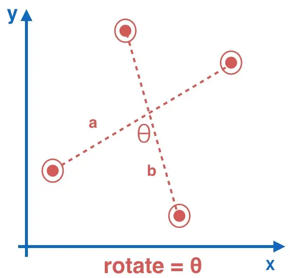
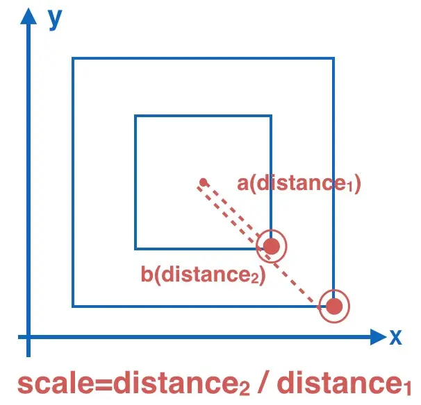
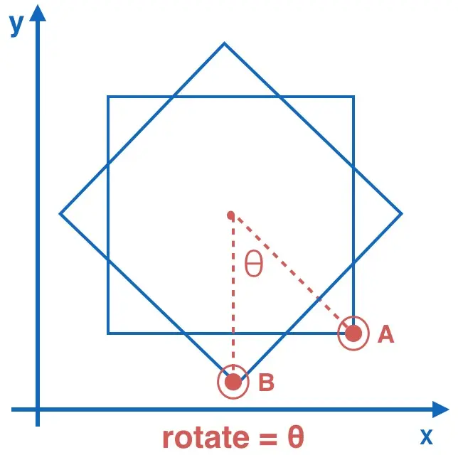

# Vector(a, b)

可用于判断手势动作等

另参考 [getPoint](/fn/getPoint/)

## 入参

| 参数 | 类型   | 必填 | 说明                  |
| :--- | :----- | :--- | :-------------------- |
| a    | ICoord | 是   | -                     |
| b    | ICoord | 否   | 默认为 `{x: 0, y: 0}` |

<<< @/src/interface/Point.ts#Point

## 示例

### 构造方式

```typescript
import { Vector } from "wsp-toolkit";
// 两种构造 Vector 的方式
const v1 = new Vector({ x: 10, y: 0 });
const v2 = Vector.of({ x: 0, y: 10 });
```

### Pinch(双指缩放)



```ts
// 省略获取Point的代码
const a = new Vector(aPoint1, aPoint2);
const b = Vector.of(bPoint1, bPoint2);

a.getScale(b); // a 放大到 b 的倍率
b.getScale(a); // b 缩小到 a 的倍率
```

### Rotate(双指旋转)



```typescript
// 省略获取Point的代码
const a = new Vector(aPoint1, aPoint2);
const b = Vector.of(bPoint1, bPoint2);

a.getAngle(b); // a 顺时针旋转到 b
b.getAngle(a); // b 逆时针旋转到 a
```

### singlePinch(单指缩放)



```ts
// 依赖基准点(正方形中间的点)进行计算, 假定值为
import { Vector } from "./Vector";

const basePoint = { x: 10, y: 10 };
// 计算 touchstart 向量模
const a = new Vector(startPoint, basePoint);

// 计算 touchend（touchmove相同操作） 向量模
const b = new Vector(currentPoint, basePoint);

a.getScale(b); // a 放大到 b 的倍率
```

### singleRotate(单指旋转)



```ts
// 依然需要依赖基准点进行计算

const a = new Vector(startPoint, basePoint);
const b = Vector(currentPoint, basePoint);

a.getAngle(b); // 计算a旋转到b的角度
```
